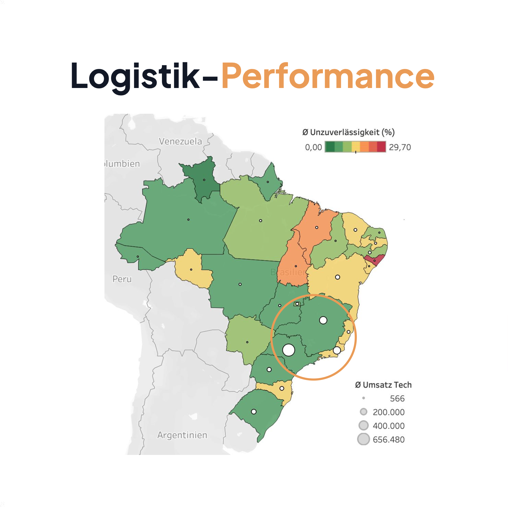
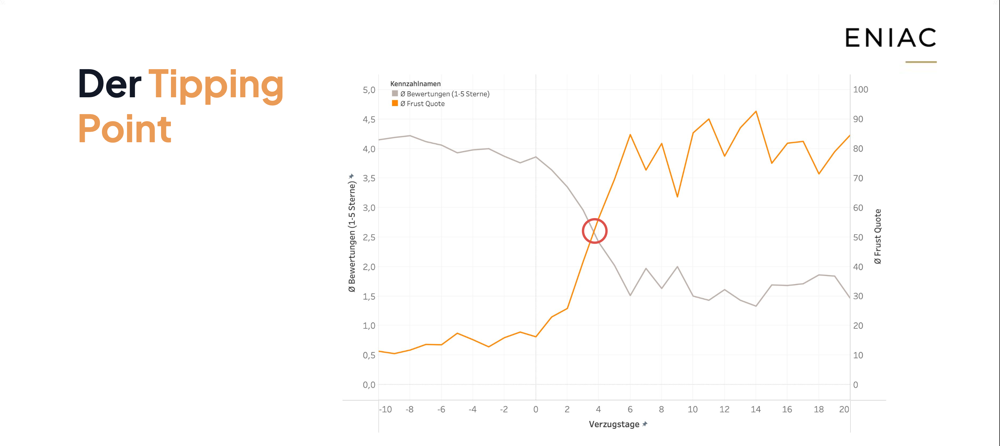
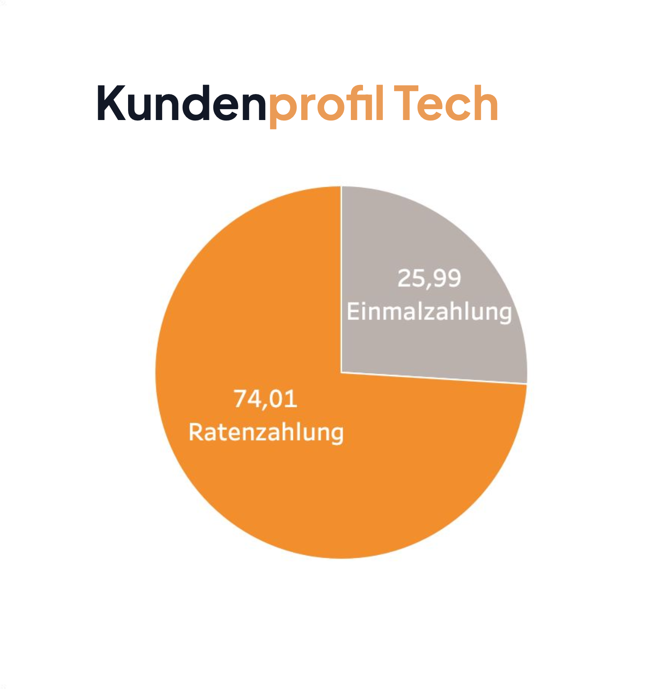
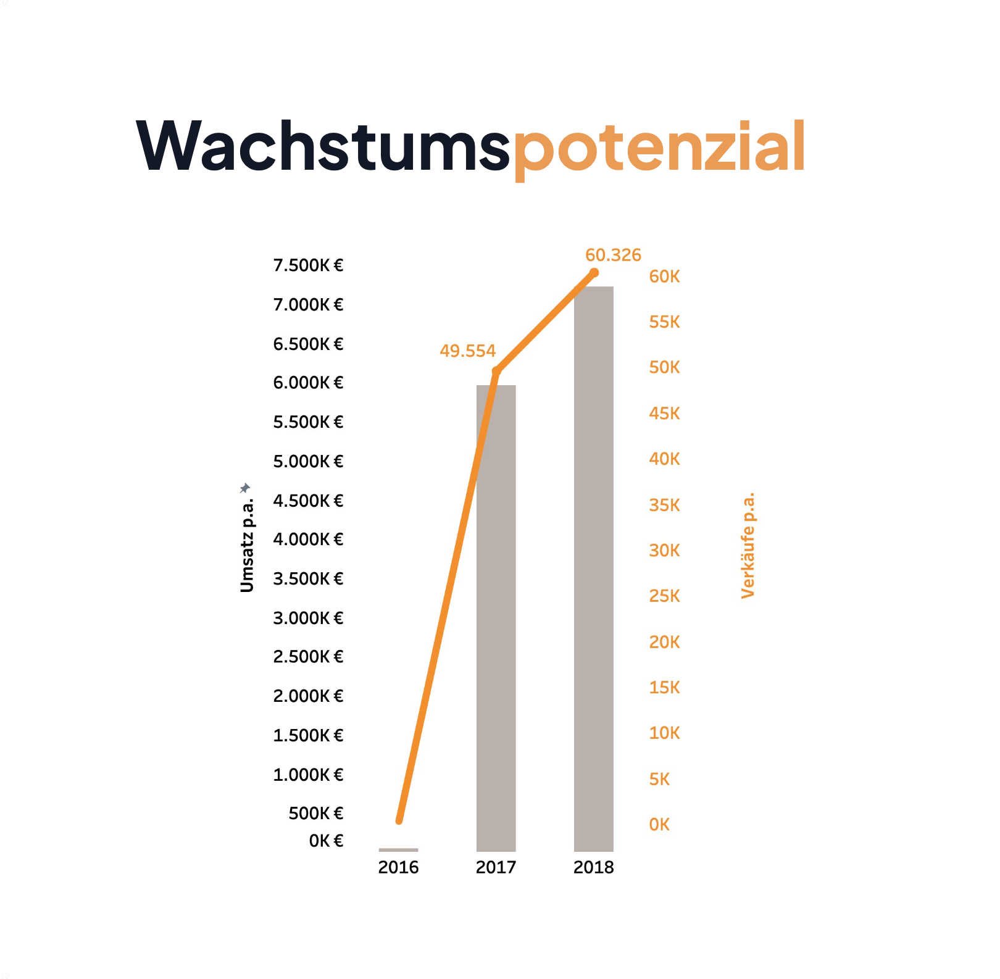

# Eniac & Magist Market Expansion Analysis [SQL | Tableau]

## Project Overview

This project evaluates a potential strategic partnership between Eniac and Magist to support Eniac's expansion into the Brazilian market.

Using SQL and Tableau, customer behavior, seller performance, logistics quality, and market potential were analyzed to determine whether Magist could be a suitable partner for Eniac's growth strategy.

## Key Findings

- More than 90% logistics reliability was observed in major metropolitan regions such as São Paulo and Minas Gerais.
- Tier-2 regions showed an estimated 15% delivery failure risk, representing the main operational challenge.
- Customer satisfaction starts to decline after only 1 day of delivery delay.
- At approximately 3.5 days delay, average ratings drop to around 2 stars, while roughly 50% of customers leave negative reviews.
- 74% of customers purchasing products above €500 use installment payments, highlighting strong demand for premium technology products.
- Magist experienced strong early growth and provides immediate access to 25+ Brazilian states without requiring investment in proprietary logistics infrastructure.

## Dashboard Preview

| Logistics Performance | Customer Satisfaction |
|----------------------|----------------------|
|  |  |

| Tech Customer Profile | Growth Potential |
|----------------------|------------------|
|  |  |

## Dashboard Preview1

  | 

 | 

## Conditional Go

Proceed with a controlled market entry through Magist, starting with a pilot phase, strict SLA monitoring, gradual scaling, and continuous performance evaluation.

## Tech Stack

- SQL
- Tableau
- Data Visualization
- Business Analytics

## Project Files

Eniac_Magist_Analyse.sql

SQL queries used for data exploration, KPI calculations, and business analysis.

Eniac_Magist_Strategy.pdf

Final business presentation containing insights, visualizations, recommendations, and strategic conclusions.

Personal Reflection

## This project helped me:

- Apply SQL and Tableau in a real-world business scenario.
- Improve analytical thinking and data-driven decision-making.
- Strengthen presentation and communication skills in German.
- Gain experience working within a collaborative project environment.
- Better understand the importance of organization, teamwork, and accountability in project management.
